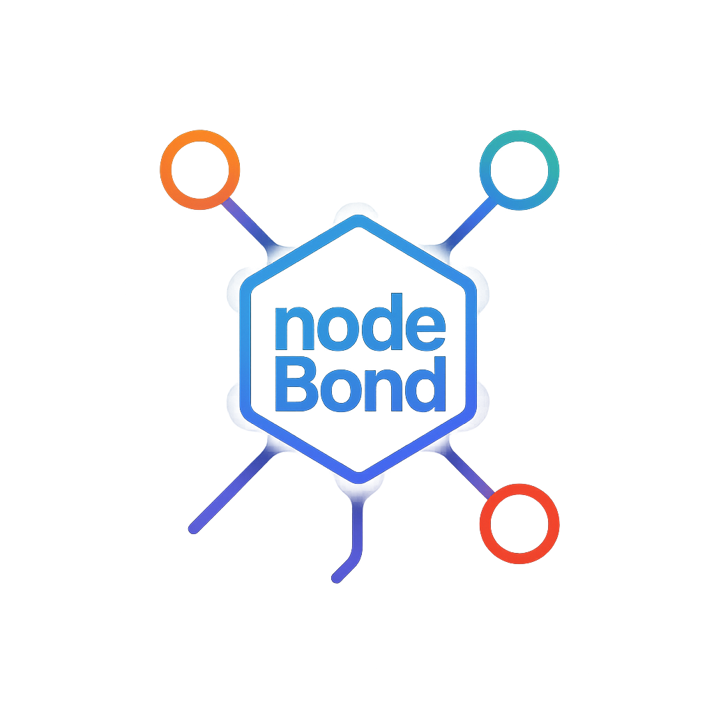

---

# 🔗 nodeBond

**nodeBond** is a tiny, fast, and secure IPC (inter-process communication) bridge for Node.js apps running on the same machine.  
No HTTP, no TCP, no extra dependencies — just clean message passing over sockets.

> 📡 Imagine an invisible cable between two `.js` processes that lets them talk instantly.

---

## 🧠 What Is IPC and Why Should You Care?

IPC (Inter-Process Communication) allows two independent processes (like separate Node.js scripts) to send messages to each other.

### Common Use Cases:
- One script controls or monitors another
- GUI (like Electron) and backend node services need to sync
- Testing complex service interactions without network setup
- Modular toolchains where parts of the system communicate locally

nodeBond makes this simple, safe, and dependency-free.

---

## 🎯 Who Is nodeBond For?

| 👤 You Are A... | nodeBond Helps You... |
|----------------|------------------------|
| **CLI Tool Developer** | Connect your tool with helper workers |
| **Electron App Maker** | Talk to node services securely without exposing ports |
| **QA Engineer / Tester** | Simulate local service interaction |
| **DevOps / Scripter** | Trigger or monitor local processes |
| **Tooling Architect** | Build modular services that cooperate |

---

## ✨ Real-World Examples

- 🧪 A `test-runner` sends results to a terminal dashboard
- 🛠 A CLI command hub starts/stops subprocesses and logs results
- 📦 A bundler sends progress updates to a live progress monitor
- 🔧 A debugger or inspector tool listens to runtime events from the app

---

## 💡 Why nodeBond?

- ⚡ Fast communication using named pipes / Unix sockets
- 🧼 Clean API: `.dual()`, `.send()`, `.on('data')`
- 🧩 Extendable with `.use()` middleware
- 🧰 CLI-ready: `send`, `inspect`, `echo`
- 🔐 Local-only & secure: no network access
- 📦 Zero dependencies — just Node.js

---

## 📦 Installation

npm install nodebond

---

## ⚙️ Quick Start

### App A (`appA.js`)

const bond = require('nodebond').dual('appA', 'appB');

bond.on('data', (msg) => {
  if (msg.__target === 'appA') {
    console.log('[AppA] received:', msg);
  }
});

bond.sendTo('appB', { from: 'appA', msg: 'Hello from A' });

### App B (`appB.js`)

const bond = require('nodebond').dual('appB', 'appA');

bond.on('data', (msg) => {
  if (msg.__target === 'appB') {
    console.log('[AppB] received:', msg);
  }
});

bond.sendTo('appA', { from: 'appB', msg: 'Hello from B' });

---

## 🛠 CLI Usage

npx nodebond send appA '{"msg":"Hello"}'  
npx nodebond send appA --text "Ping"  
npx nodebond inspect appA  
npx nodebond echo appB

---

## 🧩 Middleware Support

bond.use((msg, next) => {
  console.log('[LOG]', msg);
  next(msg);
});

---

## 📊 Statistics API

console.log(bond.stats());
/*
{
  messagesSent: 10,
  messagesReceived: 12,
  memoryUsageMB: "14.5",
  uptimeMs: 5220
}
*/

---

## ⚙️ Automatic Connection

const bond = require('nodebond').auto();

---

## 📁 Raw Buffer Support

bond.send(Buffer.from('raw-ping'));

---

## 🔐 Secure Socket (Unix only)

const { createBridge } = require('nodebond');
createBridge('secureChannel', { secure: true });

---

## 🧹 Temporary Bridges

createBridge('session-bridge', { temp: true });

---

## 🧠 API Summary

| Method | Description |
|--------|-------------|
| `dual(local, remote)` | Start server + connect to peer |
| `auto()` | Create both sides with auto-generated names |
| `.on(event, fn)` | Listen to events: `data`, `connect`, `error`, etc. |
| `.once(event, fn)` | One-time event listener |
| `.send(data)` | Send message |
| `.sendTo(name, data)` | Send to specific target |
| `.use(fn)` | Add middleware for incoming messages |
| `.stats()` | View performance & memory stats |
| `.close()` | Close connections cleanly |

---

## 🐛 Debugging

NODEBOND_DEBUG=1 node examples/appA.js

---

## 📄 License

MIT © Guliaev

---

## 🧘 Philosophy

nodeBond is designed to do one thing perfectly:  
**Connect two local Node.js apps with minimal setup and maximum clarity.**

> Plug it in. Send a message. Done.

---

## 🌐 Links

- 📦 NPM: [https://www.npmjs.com/package/nodebond](https://www.npmjs.com/package/nodebond)
- 🧾 GitHub: [https://github.com/Xzdes/nodeBond](https://github.com/Xzdes/nodeBond)
