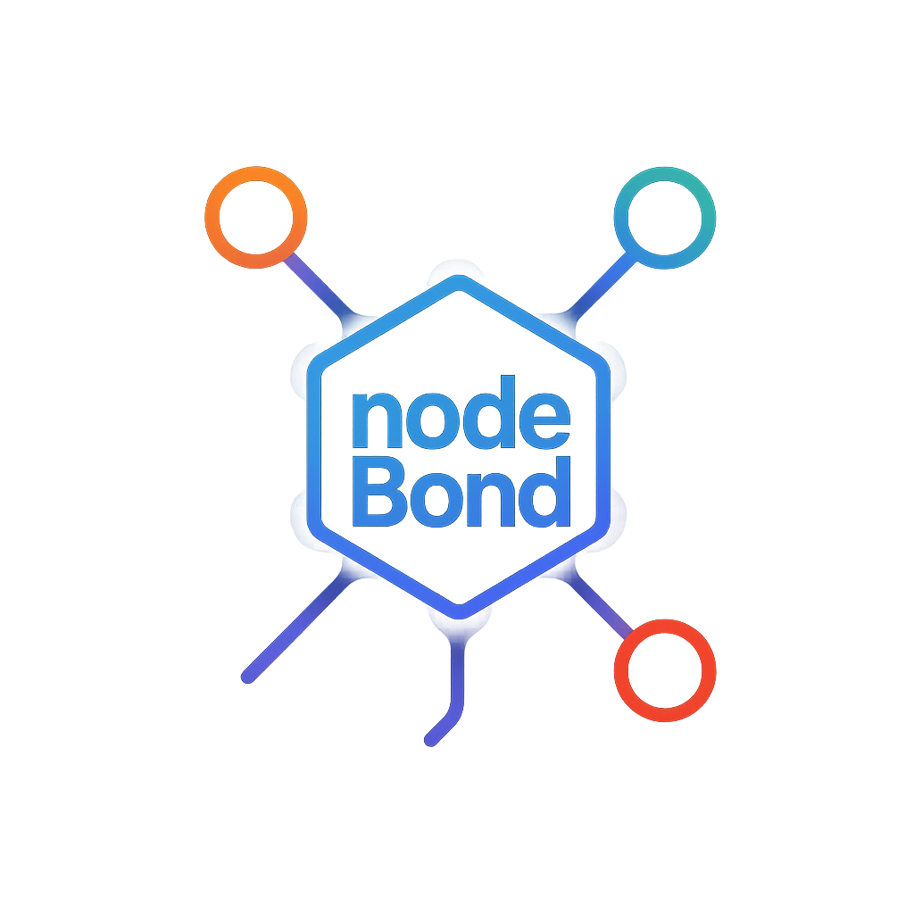

<p align="center">
  
</p>

# nodeBond

[](https://www.npmjs.com/package/nodebond)
[](https://github.com/Xzdes/nodeBond)

📖 English version available here: [README.md](README.md)

---

`nodeBond` — это лёгкая IPC-система для Node.js, позволяющая соединять несколько приложений на одной машине без внешних зависимостей. Службы могут взаимодействовать, вызывать функции друг друга и передавать данные.

## 🚀 Возможности

- IPC через Unix сокеты / именованные каналы
- Автоматическая регистрация сервисов
- Вызов функций между сервисами
- CLI для управления и отладки
- Поддержка Windows, Linux, macOS

## 📦 Установка

```bash
git clone https://github.com/Xzdes/nodeBond.git
cd nodeBond
npm install
npm link   # Регистрация команды nodebond
```


## 🧵 Запуск

Сначала запустите `hub`:

```bash
nodebond start-hub
```

Затем в отдельных окнах:

```bash
node example/db-service/index.js
node example/printer-service/index.js
node example/cashbox-service/index.js
```

## 💡 Как работает

- Сервисы регистрируются через `register()`
- Хаб рассылает реестр всем
- `call()` позволяет обращаться к методам других сервисов

### Пример: `cashbox-service`

```js
const { register, call } = require("nodebond");

register({
  id: "cashbox",
  exports: {
    ping: () => "pong"
  },
  onReady: async () => {
    await call("db.getClientById", 42);
  }
});
```

## 🔧 Использование CLI

```bash
nodebond call db.getClientById 42
nodebond get printer.status
nodebond set printer.status "ready"
```

## ❓ Решение проблем

- Убедитесь, что `hub` запущен
- Windows: `Get-ChildItem \\.\pipe\ | findstr nodebond`
- Linux/macOS: `ls /tmp/nodebond-*`

## 📄 Лицензия

MIT